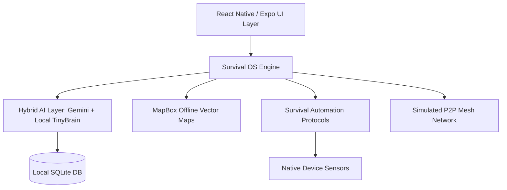

# SpitiShield AI 🏔️🛡️
### Tactical Survival OS for High-Altitude & Zero-Connectivity Environments

SpitiShield AI is a specialized mobile operating system layer designed for adventurers and local communities in the Spiti Valley and similar high-altitude regions. It leverages **Edge AI**, **Offline-First Architecture**, and **Survival Protocols** to provide life-saving assistance where traditional cellular networks fail.

---

## 🛠️ System Architecture

SpitiShield is built on a **Modular Edge Architecture** that prioritizes local execution over cloud dependency.

### 1. High-Level Diagram (Conceptual)


### 2. Core Service Modules
- **`AutomationEngine`**: Monitors altitude, battery, and symptoms in real-time to trigger emergency protocols (e.g., AMS detection).
- **`TinyBrain`**: A local rule-based inference engine that provides immediate medical triage without any internet access.
- **`LocalKnowledge`**: A pre-indexed database of Spiti-specific survival guides, medical procedures, and terrain details.
- **`MeshSync`**: A simulated peer-to-peer relay system for broadcasting SOS signals across a hypothetical decentralized network.

---

## 🤖 AI Models & Intelligence Layer

SpitiShield uses a **Hybrid Intelligence Strategy** to balance power and availability:

1.  **Google Gemini (Pro/Flash)**: 
    - **Usage**: Deep survival analysis, weather prediction interpretation, and complex medical consultation.
    - **Connectivity**: Requires intermittent connectivity or "Packet Burst" sync when a signal is found.
2.  **Spiti-TinyBrain (Local Inference)**:
    - **Usage**: Immediate triage, altitude sickness (AMS) detection, and cold-weather survival checklists.
    - **Connectivity**: **100% Offline**. This is a deterministic logic engine paired with a local knowledge base.

---

## 📡 Connectivity Strategy: Zero-Network Resilience

SpitiShield is designed for the **"Dark Zones"** of the Himalayas. Our solution handles low/zero connectivity through:

-   **Offline-First Data Storage**: All critical user data, journey logs, and medical records are stored in a local SQLite database and synced only when a stable connection is established.
-   **Vector Tile Map Caching**: The terrain maps use vector tiles that are pre-cached for the Spiti region, allowing 1:10,000 scale navigation without data.
-   **Protocol "Bursts"**: Instead of constant API polling, SpitiShield bundles all AI queries into a single encrypted packet that is sent the moment a 2G/3G signal is detected (the "Kaza Signal Catch").
-   **Sensors vs. Cloud**: The app relies on the device's barometer, GPS, and accelerometer for environmental awareness rather than cloud-based weather or location services.

---

## 🚀 Running the Project Locally

### Prerequisites
- **Node.js** (v18+)
- **Expo Go** app on your Android/iOS device
- **Google Gemini API Key** (for cloud AI features)

### Setup Steps
1.  **Clone the Repository**:
    ```bash
    git clone https://github.com/your-repo/spitishield-mobile.git
    cd spitishield-mobile
    ```
2.  **Install Dependencies**:
    ```bash
    npm install --legacy-peer-deps
    ```
3.  **Environment Variables**:
    Create a `.env` file in the root:
    ```env
    EXPO_PUBLIC_GEMINI_API_KEY=your_api_key_here
    ```
4.  **Start the Development Server**:
    ```bash
    npx expo start
    ```
5.  **Run on Device**:
    Scan the QR code with your **Expo Go** app.

---

## 📱 Download & Install (Android)

You can download the latest tactical preview of **SpitiShield AI** directly to your Android device via EAS:

👉 **[Download SpitiShield AI APK](https://expo.dev/accounts/rajsinha/projects/spitishield-mobile/builds/e66d1ef3-1d6c-4eac-9d0b-412167ddd85d)**

---

## Details

- **Track**: Disaster Management / Remote Safety
- **Key Innovation**: The "Survival OS" interface metaphor—transforming a smartphone into a dedicated tactical tool for high-altitude survival.
- **Scalability**: While built for Spiti, the logic is applicable to any remote wilderness area globally.

---
*Built with ❤️ for the survival of the adventurous.*
